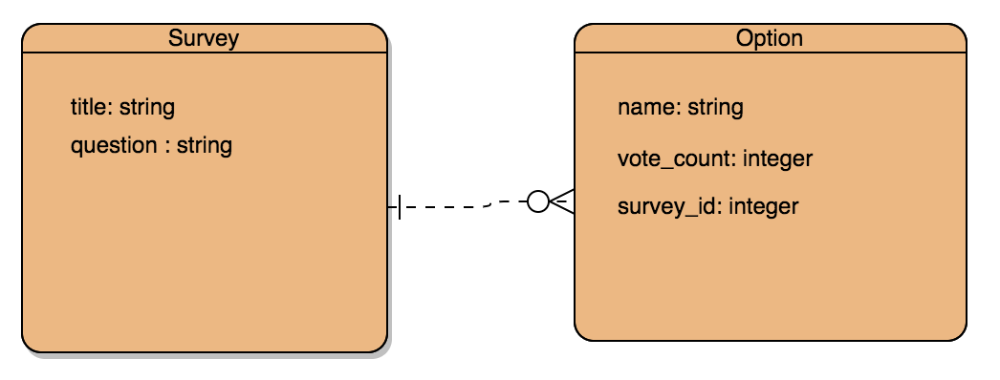

# Poll Booth
A full stack app that allows users to add, view, take, and delete surveys. It was created using Ruby on Rails, JavaScript, React, HTML, CSS, and Material-UI.

## Deployed apps and repositories
| Resource   | URL            |
|------------|----------------|
| client side, deployed    | https://pnguyen44.github.io/poll-booth/            |
| client app repo   | https://github.com/pnguyen44/poll-booth           |
| server api, deployed | https://poll-booth-api.herokuapp.com/           |
| server api repo  | https://github.com/pnguyen44/poll-booth-api    |

## ERD

## API Endpoints
| Verb   | URI Pattern             | Controller#Action    |
|--------|-------------------------|----------------------|
| GET    | `/surveys`           | `surveys#index`   |
| POST   | `/surveys`           | `surveys#create`  |
| GET    | `/surveys/:id`       | `surveys#show`    |
| PATCH  | `/surveys/:id`       | `surveys#update`  |
| DELETE | `/surveys/:id`       | `surveys#destroy` |
| GET    | `/options`           |`options#index`        |
| POST   | `/options`           |`options#create`       |
| GET    | `/options/:id`       |`options#show`         |
| PATCH  | `/options/:id`       |`options#update`       |
| DELETE | `/options/:id`       |`options#destroy`      |

## User Stories
- Users can create survey
- Users can take survey
- Users can delete surveys

## Technologies Used
- Front End
  - React JS
  - React Router
  - Javascript
  - Material UI
  - HTML
  - CSS
  - Node Package Manager
  - Chart.js

- Back End
  - Ruby on Rails
  - Heroku
